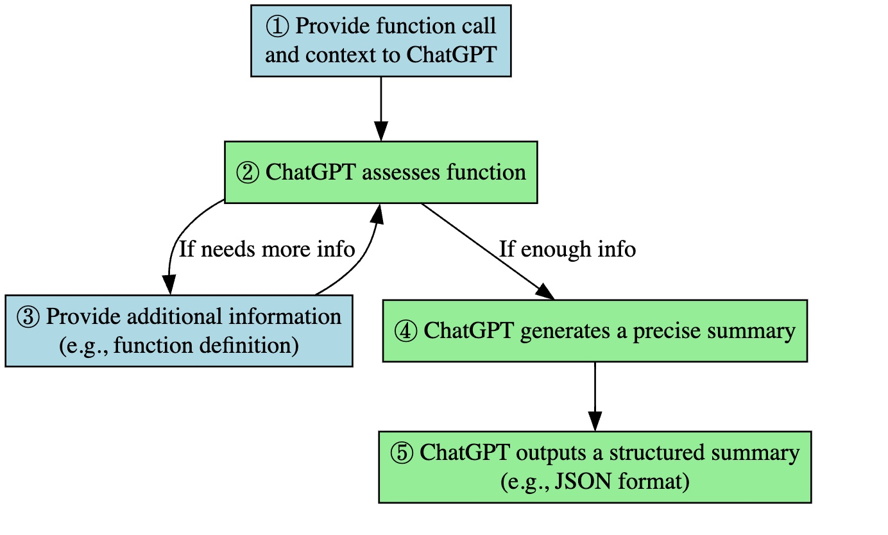
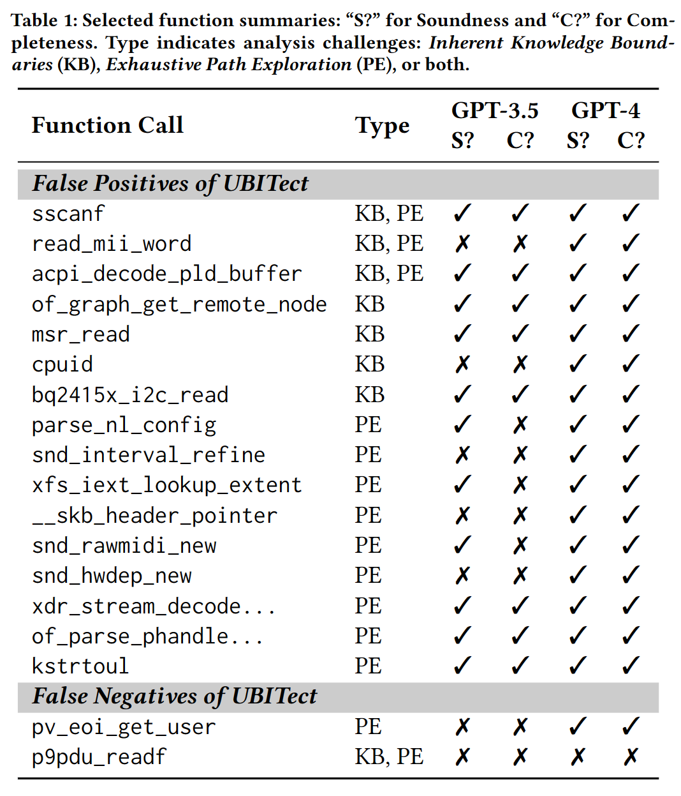

# Assisting Static Analysis with Large Language Models: A ChatGPT Experiment

## Summary
We investigate where and how _Large Language Models (LLMs)_ can assist static analysis by asking appropriate questions. In particular, we target a specific bug-finding static analysis tool that produces a large number of _false positives_. With ChatGPT, we found it is very promising to filter out those FPs efficiently, and could even find missed real bugs that ignored by static analysis.

## Method:
Use ChatGPT to evaluate if a function initializes parameters for each function call:

- Provide necessary context, such as return value checks ( The context preparing could also finished by ChatGPT)
- Engage in an iterative process, allowing ChatGPT to request additional information (such as function definitions)
- Prompt ChatGPT to generate a structured summary after analysis

## Result

## Future Work
- Our method should really find several missed bugs
- Our method should get a better result even symbolic execution won’t timeout (symbolic execution is still not perfect due to many reasons, such as asm code. ChatGPT is free of them); 
- Our method should be more reliable. ChatGPT is non-deterministic by design, we need to mitigate it. We should show our method could always (or, most cases) give correct and reliable answers.
- Our method should also work in other analysis. The unit in our analysis is function, so we believe many summary based inter-procedure analysis could benefit from our method.

